# Project 5 IPL Data Analysis
### IPL = Indian Premier League

# a.- Análisis en profundidad del rendimiento de David Warner (bateador australiano)

1. [Obtener los datos de DA Warner ](#schema1)
2. [Obtener los valores de los bateos](#schema2)
3. [Obtener los valores de los batsman runs para buscar cual es el que más hace](#schema3)

# b.- Analizar cada equipo
4. [Obtenemos los nombre de los equipos y los sustituimos por la abreviaturas.](#schema4)
5. [Distribución de puntos para equipos por entradas](#schema5)

# c.-cuántas veces los equipos marcan más de 200
6. [Creamos el dataframe con los valores que vamos a usar.](#schema6)
7. [Creamos un data donde los valores de `total_runs >200'](#schema7)

# 1. Obtener los datos de DA Warner

Creamos un filtro para obtener solo los datos de  `David Warner`

~~~python
filt=(df['batsman']=='DA Warner')
df_warner=df[filt]
df_warner.head()
~~~
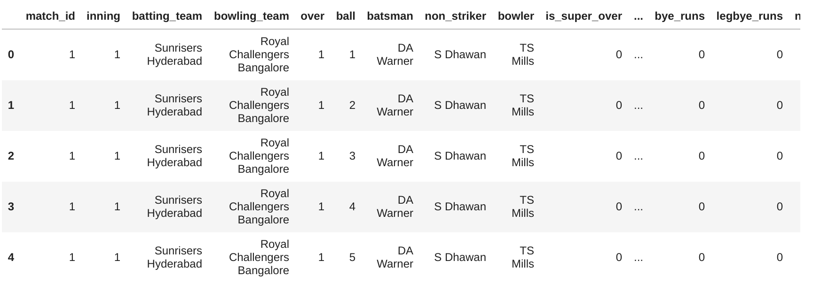

# 2. Obtener los valores de los bateos
~~~python
df_warner['dismissal_kind'].value_counts()
df_warner['dismissal_kind'].value_counts().plot.pie()
plt.savefig("./images/dimissal.png")
~~~
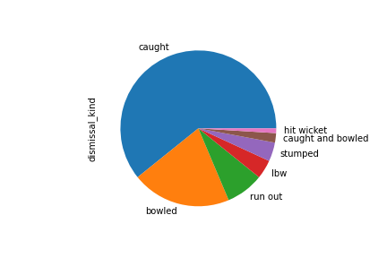

# 3. Obtener los valores de los batsman runs para buscar cual es el que más hace
~~~python
df_warner['batsman_runs'].value_counts()
~~~
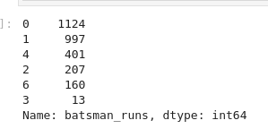

Para calcular cualquier valor de los runs, hacemos una función.
~~~python
def count_runs(df,runs):
    return (len(df_warner[df_warner['batsman_runs']==runs]))*runs
~~~
Obtenemos los valores y dibujamos un `pie`
~~~python
labels = [1,2,3,4,6]
slices = []
for run in labels:
    slices.append(count_runs(df_warner, run))

plt.pie(slices, labels = labels)
plt.savefig("./images/runs.png")  
~~~
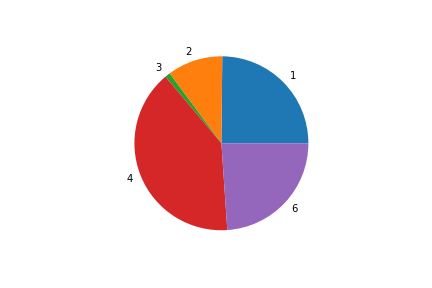

Y ahora con porcentajes
~~~python
plt.pie(slices, labels = labels, autopct = '%1.1f%%')
plt.savefig("./images/runs_port.png")
~~~
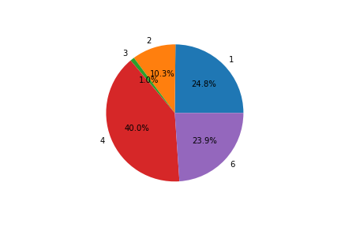

# 4. Obtenemos los nombre de los equipos y los sustituimos por la abreviaturas.
Creamos un diccionario con los nombres de los equipos y las abreviaturas y mapeamos cada columna donde esten los equipos
~~~python
Teams={
    'Royal Challengers Bangalore':'RCB', 
    'Sunrisers Hyderabad':'SRH',
       'Rising Pune Supergiant':'RPS',
    'Mumbai Indians':'MI',
       'Kolkata Knight Riders':'KKR', 
    'Gujarat Lions':'GL',
    'Kings XI Punjab':'KXIP',
       'Delhi Daredevils':'DD',
    'Chennai Super Kings':'CSK',
    'Rajasthan Royals':'RR',
       'Deccan Chargers':'DC',
    'Kochi Tuskers Kerala':'KTK',
    'Pune Warriors':'PW',
       'Rising Pune Supergiants':'RPS'
}
df['batting_team'] = df['batting_team'].map(Teams)
df['bowling_team'] = df['bowling_team'].map(Teams)
~~~
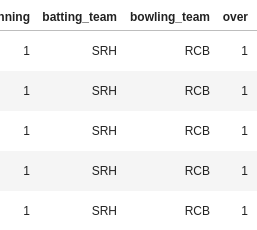

# 5 Distribución de puntos para equipos por entradas

~~~python
runs=df.groupby(['match_id','inning','batting_team'])[['total_runs']].sum().reset_index()
runs.drop('match_id',axis=1,inplace=True)
~~~
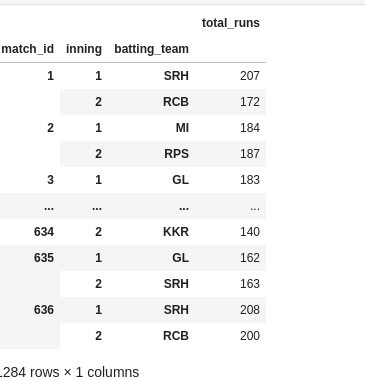

~~~python
inning1 = runs[runs['inning'] == 1]
inning2 = runs[runs['inning'] == 2]
~~~
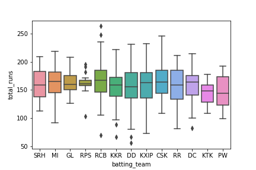
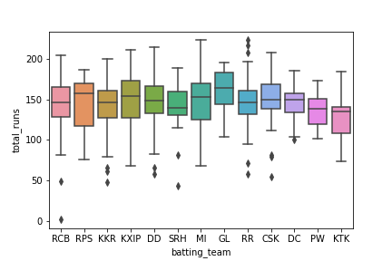

# 6. Creamos el dataframe con los valores que vamos a usar.
~~~python
score = df.groupby(['match_id','inning','batting_team','bowling_team'])[['total_runs']].sum().reset_index()
~~~
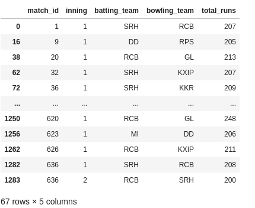

# 7. Creamos un data donde los valores de `total_runs >200'
~~~python
score_200 = score[score['total_runs']>=200]
sns.countplot(score_200['batting_team'])

~~~
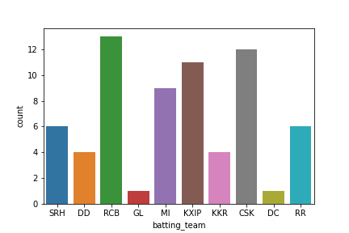
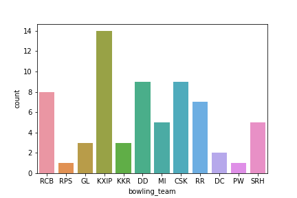

Datos
https://drive.google.com/drive/u/0/folders/1101-XU7OimDoHsKg5fcrJsv3BlFYnFm3