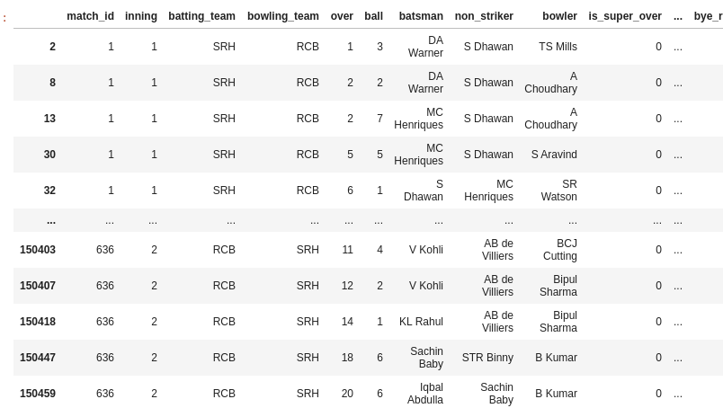
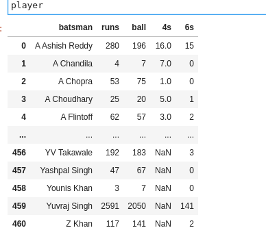
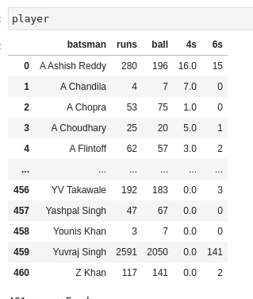

# Project 5 IPL Data Analysis
### IPL = Indian Premier League
deliveries.ipynb

# a.- Análisis en profundidad del rendimiento de David Warner (bateador australiano)

1. [Obtener los datos de DA Warner ](#schema1)
2. [Obtener los valores de los bateos](#schema2)
3. [Obtener los valores de los batsman runs para buscar cual es el que más hace](#schema3)

# b.- Analizar cada equipo
4. [Obtenemos los nombre de los equipos y los sustituimos por la abreviaturas.](#schema4)
5. [Distribución de puntos para equipos por entradas](#schema5)

# c.-cuántas veces los equipos marcan más de 200
6. [Creamos el dataframe con los valores que vamos a usar.](#schema6)
7. [Creamos un data donde los valores de `total_runs >200`](#schema7)

# d.- Comparación de bateador

8. [Creamos los dataframe  que necesitamos](#schema8)
9. [btener el máximo de runs de cada bateador](#schema9)
10. [Mejores puntuaciones individuales cada bateador](#schema10)

# 1. Obtener los datos de DA Warner

Creamos un filtro para obtener solo los datos de  `David Warner`

~~~python
filt=(df['batsman']=='DA Warner')
df_warner=df[filt]
df_warner.head()
~~~

# 2. Obtener los valores de los bateos
~~~python
df_warner['dismissal_kind'].value_counts()
df_warner['dismissal_kind'].value_counts().plot.pie()
plt.savefig("./images/dimissal.png")
~~~

# 3. Obtener los valores de los batsman runs para buscar cual es el que más hace
~~~python
df_warner['batsman_runs'].value_counts()
~~~

Para calcular cualquier valor de los runs, hacemos una función.
~~~python
def count_runs(df,runs):
    return (len(df_warner[df_warner['batsman_runs']==runs]))*runs
~~~
Obtenemos los valores y dibujamos un `pie`
~~~python
labels = [1,2,3,4,6]
slices = []
for run in labels:
    slices.append(count_runs(df_warner, run))

plt.pie(slices, labels = labels)
plt.savefig("./images/runs.png")  
~~~

Y ahora con porcentajes
~~~python
plt.pie(slices, labels = labels, autopct = '%1.1f%%')
plt.savefig("./images/runs_port.png")
~~~

# 4. Obtenemos los nombre de los equipos y los sustituimos por la abreviaturas.
Creamos un diccionario con los nombres de los equipos y las abreviaturas y mapeamos cada columna donde esten los equipos
~~~python
Teams={
    'Royal Challengers Bangalore':'RCB', 
    'Sunrisers Hyderabad':'SRH',
       'Rising Pune Supergiant':'RPS',
    'Mumbai Indians':'MI',
       'Kolkata Knight Riders':'KKR', 
    'Gujarat Lions':'GL',
    'Kings XI Punjab':'KXIP',
       'Delhi Daredevils':'DD',
    'Chennai Super Kings':'CSK',
    'Rajasthan Royals':'RR',
       'Deccan Chargers':'DC',
    'Kochi Tuskers Kerala':'KTK',
    'Pune Warriors':'PW',
       'Rising Pune Supergiants':'RPS'
}
df['batting_team'] = df['batting_team'].map(Teams)
df['bowling_team'] = df['bowling_team'].map(Teams)
~~~

# 5 Distribución de puntos para equipos por entradas

~~~python
runs=df.groupby(['match_id','inning','batting_team'])[['total_runs']].sum().reset_index()
runs.drop('match_id',axis=1,inplace=True)
~~~

~~~python
inning1 = runs[runs['inning'] == 1]
inning2 = runs[runs['inning'] == 2]
~~~

# 6. Creamos el dataframe con los valores que vamos a usar.
~~~python
score = df.groupby(['match_id','inning','batting_team','bowling_team'])[['total_runs']].sum().reset_index()
~~~

# 7. Creamos un data donde los valores de `total_runs >200'
~~~python
score_200 = score[score['total_runs']>=200]
sns.countplot(score_200['batting_team'])

~~~

# 8. Creamos los dataframe  que necesitamos
Primero los bateadores con los golpes a las bolas
~~~python
balls = df.groupby(['batsman'])['ball'].count().reset_index()
~~~

Segundo  data con los bateadores y la veces que hacen runs
~~~python
runs=df.groupby(['batsman'])['batsman_runs'].sum().reset_index()
runs.columns=['batsman','runs']
~~~

Tercero data con los `batsman runs = 4`
~~~python
four = df[df['batsman_runs'] == 4]
~~~

~~~python
runs_4 = four.groupby('batsman')['batsman_runs'].count().reset_index()
runs_4.columns=['batsman','4s']
~~~

Lo mismo para `batsman runs = 6`
~~~python
six=df.groupby('batsman')['batsman_runs'].agg(lambda x: (x==6).sum()).reset_index()
six.columns=['batsman','6s']
~~~

Creamos el dataframe con los datos de casa jugador
~~~python
player = pd.concat([runs,balls.iloc[:,1],runs_4.iloc[:,1], six.iloc[:,1]],axis = 1)
~~~

Rellenemos con `0` los valores nulos
~~~python
player.fillna(0, inplace = True)
~~~

Añadimos una columnda de `strike_rate`
~~~python
player['strike_rate']=(player['runs']/player['ball'])*100
~~~

# 9. Obtener el máximo de runs de cada bateador
~~~python
grp=df.groupby(['match_id','batsman','batting_team'])['batsman_runs'].sum().reset_index()
max_runs = grp.groupby('batsman')['batsman_runs'].max().reset_index()
max_runs.columns = ['batsman', 'max_runs']
max_runs
~~~ 

Concatenamos los dos dataframe

~~~python
player_max = pd.concat([player, max_runs.iloc[:,1]], axis = 1)
player_max
~~~

Obtener el top 10 de los bateadores
~~~python
sum_runs = df.groupby('batsman')['batsman_runs'].sum()
sum_runs.sort_values(ascending=False)[:10].plot(kind = 'bar')

~~~

# 10. Mejores puntuaciones individuales cada bateador
~~~python
player_sort = df.groupby(['match_id','batsman','batting_team'])['batsman_runs'].sum().reset_index().sort_values(by = 'batsman_runs',ascending = False)
player_sort.head(10)
~~~

Crear data con los golpes

~~~python
dimissal_kinds = ['caught', 'bowled', 'run out', 'lbw', 'caught and bowled','stumped',' it wicket']
hwt = df[df['dismissal_kind'].isin(dimissal_kinds)]
hwt.head()
~~~

~~~python
hwt['bowler'].value_counts()[:10].plot(kind = 'bar')
plt.savefig("./images/bowler_10.png")
~~~

# 11. Cargamos los datos y obtenemos los nulos

~~~python
df=pd.read_csv('./data/matches.csv')
df.isnull().sum()
df.drop(['umpire3'], axis = 1, inplace = True)
~~~

Cambiamos lo nombres de los equipos por abreviaturas
~~~python
Teams={
    'Royal Challengers Bangalore':'RCB', 
    'Sunrisers Hyderabad':'SRH',
       'Rising Pune Supergiant':'RPS',
    'Mumbai Indians':'MI',
       'Kolkata Knight Riders':'KKR', 
    'Gujarat Lions':'GL',
    'Kings XI Punjab':'KXIP',
       'Delhi Daredevils':'DD',
    'Chennai Super Kings':'CSK',
    'Rajasthan Royals':'RR',
       'Deccan Chargers':'DC',
    'Kochi Tuskers Kerala':'KTK',
    'Pune Warriors':'PW',
       'Rising Pune Supergiants':'RPS'
}
df['team1'] = df['team1'].map(Teams)
df['team2'] = df['team2'].map(Teams)
~~~

# 12. Algunos análisis básicos

La mayoría de los premios al hombre del partido
~~~python
df['player_of_match'].value_counts()
~~~

Ganancia máxima por carreras
~~~python
df[df['win_by_runs']==df['win_by_runs'].max()]
~~~

Mumbai Indians (MI) derrotó a Delhi Daredevils (DD) con la mayor diferencia de carreras

Mayores victorias por ventanillas
~~~python
df[df['win_by_wickets']==df['win_by_wickets'].max()]
~~~

Datos
https://drive.google.com/drive/u/0/folders/1101-XU7OimDoHsKg5fcrJsv3BlFYnFm3